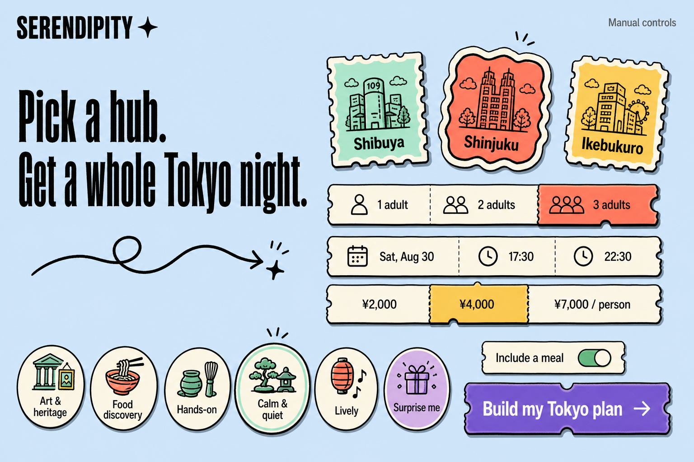
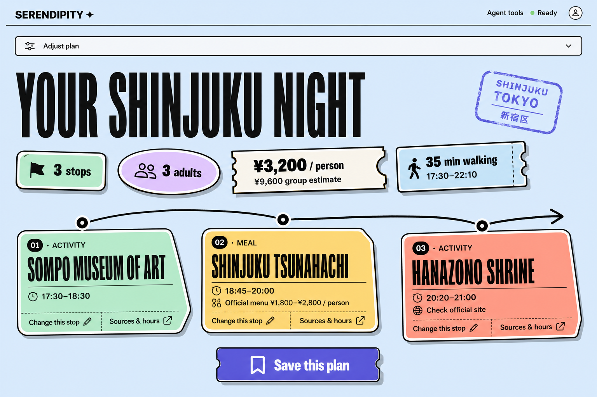
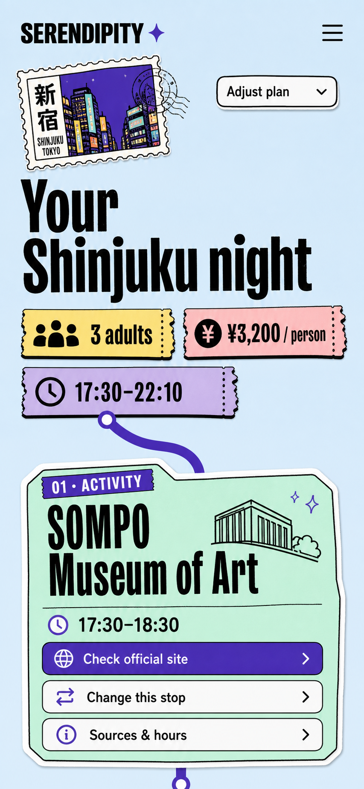

# Implementation Plan: Tokyo three-hub meal planner

**Spec**: [spec.md](spec.md)
**Contract**: [contracts/planner-v3.md](contracts/planner-v3.md)
**Data model**: [data-model.md](data-model.md)
**Verification**: [test-matrix.md](test-matrix.md)

## Summary

Build v3 in parallel with the verified v2 product. Reuse v2's exact-schema
validation, reviewed-claim boundary, deterministic route engine, safe envelope,
operation locking, local-storage repair, Site Tool lifecycle, and accessibility
infrastructure. Add area registry, party/per-person pricing, activity/meal route
grammar, official-menu restaurants, optional request-scoped Google Places
enrichment, and a full-width ticket/sticker result UI.

Do not mutate v1/v2 contracts or data. Implement `/v3` and `/v3/plan` first;
promote the exact verified Hub deployment only after all three areas, Google-off
fallback, exact-five Site Tools, and release gates pass.

## Technical context and existing-system boundary

- **Runtime**: Next.js App Router Hub, TypeScript strict mode, pnpm monorepo.
- **Reusable modules**: `@serendipity/contracts/planner-v2`,
  `@serendipity/bundle-engine/planner-v2`, Hub v2 runtime/controller/storage,
  `@serendipity/webmcp`, shared UI primitives, Vitest, and Playwright.
- **New parallel exports**: `@serendipity/contracts/planner-v3` and
  `@serendipity/bundle-engine/planner-v3`; no v2 schema constants are changed.
- **Persistence**: versioned static area packs plus reviewed claim ledgers;
  browser-only v3 saved plans. No database migration.
- **External integration**: Google Places API (New), server only and optional.
  Providers, Supabase, Tabelog, maps SDKs, and runtime scraping are absent.
- **Rollback**: current v2 production deployment
  `dpl_CLfLvnMvXbSVtK1ciH4kc4DvnbS6`; original reservation demo remains at
  `/legacy/network-demo`.

## Design references

These generated images define hierarchy, density, colour, and responsive intent.
They are not pixel-perfect requirements and must not be shipped as screenshots or
treated as evidence for venue facts.







Implementation rules derived from the references:

- Landing keeps one coherent first-viewport form, not nested dashboards.
- Result collapses the form into `Adjust plan` and uses the full content width.
- Ticket/sticker shapes encode area, party, amount, time, and stop kind; they do
  not encode Provider or availability state.
- Real venue photos/logos are not required. Decorative line art must be
  self-authored, generated with recorded rights, or code-native; otherwise omit
  it.
- Semantic reading order, focus order, contrast, reflow, and reduced motion win
  over decorative rotation.

## Architecture and data flow

### Area registry and source packs

Add one registry that resolves the closed area enum to an immutable
`pack + reviewedClaims + station + supportedInterestPresets + evidence resolver`
entry. Each pack remains separately versioned and promotable, but the public v3
release gate requires all entries ACTIVE.

```text
normalized intent
  -> resolve ACTIVE area entry
  -> validate pack against its reviewed ledger and freshness horizon
  -> enumerate official-source feasible plans (top deterministic candidates)
  -> optionally enrich up to three distinct meal place IDs through Google
  -> remove only restaurants explicitly closed/non-operational
  -> select first remaining ranked plan
  -> exact v3 envelope + transient Google signal + no-store
  -> shared controller -> UI and/or Site Tool result
```

Use separate JSON/TypeScript data modules per hub under `apps/hub/data/` and a
single read-only registry. Source-review scripts must generate a complete
version-bound claim projection and fail on any place, source, usage, attribution,
date, station, preset, or root-license drift.

### Composition engine

The v3 engine is pure except for injected `asOf` and receives one validated area
pack. It enumerates distinct place sequences by the grammar in FR-305, schedules
them using v2 opening/wait/headroom rules, applies hard constraints, and scores
the feasible set.

Ranking weights remain simple and reviewable:

| Dimension                 | Weight | Normalization                                               |
| ------------------------- | -----: | ----------------------------------------------------------- |
| Interest fit              |     40 | `SURPRISE` neutral; otherwise matching-stop ratio           |
| Walking efficiency        |     25 | lower total estimated minutes is better                     |
| Time use                  |     20 | more of the requested window used without overrun           |
| Activity category variety |     15 | distinct activity categories; meal does not inflate variety |

Tie-break in order: score descending, walk ascending, official max price
ascending, end time ascending, canonical plan ID ascending. Generate IDs from
area pack version, canonical intent, stop IDs, and scheduled timestamps with
SHA-256. Google does not enter IDs or scores; it can only remove an explicitly
closed/non-operational meal candidate from the pre-ranked result set.

Search computes enough ranked candidates to cover at most three distinct meal
place IDs. Google calls run in parallel after pure composition. With enrichment
off or unknown, select the first route. With a definite closed signal, skip its
route and select the next; if every enriched meal is definitely closed, return
`NO_VALID_PLAN` with an adjustment message rather than silently ignore the
signal.

Swap fixes non-target place IDs and target kind, recomposes the entire route,
then applies the requested preference. It runs the same Google boundary for a
replacement meal. `NO_REPLACEMENT` and upstream degradation retain the existing
plan.

### Google Places gateway

Implement a server-only adapter behind an injected interface so engine/API tests
never need network. The production adapter:

- activates only when `GOOGLE_PLACES_ENABLED=true` and a non-empty server-only
  `GOOGLE_PLACES_API_KEY` exists;
- accepts only a place ID found in the selected reviewed area pack and builds a
  fixed `https://places.googleapis.com/v1/places/{encodedPlaceId}` request;
- sends `X-Goog-Api-Key` and exact field mask
  `id,businessStatus,currentOpeningHours,priceLevel,priceRange,googleMapsUri,attributions`;
- uses `languageCode=en`, `regionCode=JP`, a two-second abort timeout, no retry,
  and no more than three distinct requests per search;
- exact-validates response keys/types, confirms returned `id`, converts only JPY
  price ranges, normalizes opening status, and discards the raw body;
- writes neither request nor response content to logs, analytics, build output,
  application cache, localStorage, or evidence files. Only request-local Promise
  deduplication is allowed; no cross-request memory or CDN cache is used;
- maps all failure classes to `UNKNOWN`/`NOT_REQUESTED` plus a safe warning and
  never exposes the key, request headers, upstream body, or Google error text.

The checked-in pack and saved plan may contain the reviewed place ID only.
Transient response fields are structurally separated as `GooglePlaceSignalV3`
and stripped by the storage serializer rather than relying on callers to omit
them. Every endpoint returning a signal uses `Cache-Control: no-store`.

Google Maps policy requires public Terms and Privacy pages, visible attribution
without a map, and no caching except allowed identifiers. Before each release,
rerun policy review against:

- [Places API policies and attribution](https://developers.google.com/maps/documentation/places/web-service/policies)
- [Place Details (New) and field masks](https://developers.google.com/maps/documentation/places/web-service/place-details)
- [Place data field definitions](https://developers.google.com/maps/documentation/places/web-service/data-fields)

If policy, billing, key restriction, or attribution compliance is unresolved,
ship with the feature flag off. Official evidence remains the complete product
path.

### API and controller

Add v3 handlers under `/api/v3`; retain v2 routes untouched. All v3 endpoints
use a 16KiB request limit, a 64KiB serialized response limit,
`Cache-Control: no-store`, `X-Correlation-Id`, normalized errors, exact success
validators, and the public-payload safety scanner.

The client controller owns `find`, `showEvidence`, `swap`, `save`, and
`deleteSaved`. Manual form submission and Site Tools invoke these functions
directly. The URL is an allowlisted projection of the last committed intent:

```text
area,party,date,start,end,budget,meal,interest,walk,exclude,auto
```

Custom valid Site Tool times/budget/walk/exclusions must appear in the form.
`auto=1` runs once after landing navigation; history navigation restores form
and plan state without a second stale execution.

Use the v2 phase set `idle | searching | planned | swapping | no_results |
error`; evidence, Google context, save, delete, and dialogs are inline state.
Every async operation captures an operation epoch plus source plan ID. Abort and
identity checks run before network, after await, before reducer dispatch, and
before storage mutation.

### UI and state

Implement parallel v3 landing/planner components and a dedicated stylesheet;
do not make v2 components conditional on schema version. During preview,
`/v3` and `/v3/plan` render v3 while `/` and `/plan` remain v2.

After a successful search:

- focus the result summary with `preventScroll`, then align it to the top;
- collapse `Adjust plan` by default;
- show route title and no more than 35 summary words;
- show compact stickers for stops, party, per-person/group totals, time, and
  coordinate-estimated walk;
- present stops in semantic route order and show the first stop's key facts in
  the first mobile viewport;
- place source/hour/menu detail and Google content in separate disclosures;
- use one `Change this stop` button to open a labelled modal with
  `CHEAPER`, `LESS_WALKING`, and `DIFFERENT_INTEREST` choices;
- keep `Save this plan` as the only primary CTA.

No decorative element may be focusable or announced. Disable rotations under
forced-colours/reduced-motion where they reduce legibility. Mobile is one
column; desktop is one full-width result flow, never a persistent form/result
50:50 dashboard.

### UI completion follow-up

Remove resting rotation from every functional control, summary, stamp, and
route card. Retain the sticker identity with consistent 2px borders, 4px
shadows, colour, and 16–20px radii. Use deterministic interest grids of 6, 3,
and 2 columns at the specified breakpoints. Replace pseudo-element route nodes
with testable decorative DOM elements whose centres derive from plan count.

The shared `find` controller starts the real request and a 700ms presentation
clock together. `SEARCH_STARTED` carries transport and start time. The progress
component advances at 220ms and 470ms, stays pending after 700ms if the request
is unfinished, and commits success or no-result only after both request and
presentation complete. Abort, validation, and transport failure bypass the
minimum. Reduced motion retains text and timing but disables bar/pulse/fade.

Extend internal activity projection with correlation ID and measured duration;
do not change public REST or Site Tool schemas. The progress source is `Planner`
for visible controls and `AI tool · find_evening_plan` only for actual Site Tool
execution.

### Submission visual rescue

The 2026-09-01 user review supersedes the prior visual-completion claim. Remove
the redundant area stamp and all route rail/node DOM. Preserve route semantics
with the ordered list, `01/02/03`, and a source-aware walk label inside each
card. Use deterministic summary grids of 4×1 or 2×2 and clip all segmented
selection fills to a shared 16px parent radius.

Raise the presentation minimum to 2100ms with stages at 0/500/1150/1750ms:
understanding choices, checking published hours/menu prices, comparing routes/
walking, and preparing the plan. Show role slots derived only from intent. A
slow request remains pending after 2100ms; abort and failure remain immediate.
Treat 1600/1280/1067/800px as real browser-zoom proxies rather than changing the
root font size alone.

### Storage

Create a v3 serializer independent of v2. The persisted type intentionally
cannot contain `GooglePlaceSignalV3`; it accepts only normalized intent,
immutable official plan/evidence snapshots, reviewed Google place IDs, and
`savedAt`. Load validates each record independently, retains valid records,
reports corruption, and preserves unreadable source bytes. Explicit save/delete
may repair readable partial corruption. The 11th plan and data above 256KiB fail
without eviction.

Opening a saved record renders the official snapshot immediately. If Google is
enabled, evidence refresh may request current context again from the registered
place IDs using the saved stop's strict `startsAt`/`endsAt` query pair; failure
never invalidates the saved official plan and refreshed Google content is not
persisted.

## Compatibility, rollout, and rollback

1. **Baseline**: record v2 deployment, current commit, source-pack versions, and
   v1/v2 test state. Do not edit 001/002 artifacts to imply v3 behavior.
2. **Walking skeleton**: ship one Shibuya `Activity -> Meal -> Activity` path to
   `/v3/plan` within 24 hours, with Google off acceptable.
3. **Data promotion**: source-audit Shibuya, Shinjuku, and Ikebukuro independently;
   production promotion still requires all three ACTIVE.
4. **Preview candidate**: freeze one commit/deployment and run all local,
   source, browser, exact-five, security, accessibility, and policy gates.
5. **Promotion**: on that same deployment, move v2 to
   `/legacy/source-planner`, point `/` and `/plan` to v3, preserve
   `/legacy/network-demo`, and promote the alias without rebuilding.
6. **Production validation**: run 3/3 Site Tool flows, 20/20 searches, Google-on
   and Google-off smoke, link/source audit, Lighthouse, and 15-minute error-log
   observation.
7. **Rollback**: on the first non-favicon release failure, stop traffic tests,
   promote `dpl_CLfLvnMvXbSVtK1ciH4kc4DvnbS6`, verify `/` and `/plan`, and leave
   failed v3 preview evidence intact for diagnosis. Never patch Provider or
   Supabase to recover v3.

Stop-loss:

- If the four-hour spike cannot verify three official-menu restaurants in any
  new hub, keep that hub CANDIDATE and do not present v3 as a three-hub product.
- If the Shibuya walking skeleton is not usable in 24 hours, freeze v3 preview,
  keep v2 production, and remove Google work from the critical path.
- If the Google key/billing/policy gate is incomplete by the UI freeze, set the
  flag off and ship the official-menu-only path.
- Forty-eight hours before submission, remove nonessential polish rather than
  weaken source, storage, accessibility, or release gates.

## Requirement mapping

| Requirements  | Design element                                              | Primary evidence         |
| ------------- | ----------------------------------------------------------- | ------------------------ |
| FR-301–FR-304 | Exact v3 intent, URL/form parity, area preset manifest      | V3-CTR, V3-UX, V3-FIX    |
| FR-305–FR-309 | Grammar-aware pure composer and official per-person pricing | V3-ENG, V3-PRICE         |
| FR-310–FR-313 | Three area packs, reviewed ledgers, source/Tabelog audits   | V3-DATA, V3-SRC          |
| FR-314–FR-317 | Allowlisted request-scoped Google gateway                   | V3-GGL, V3-SEC           |
| FR-318–FR-319 | Deterministic ranking and same-kind swap                    | V3-ENG, V3-SWAP          |
| FR-320–FR-323 | Full-width sticker UI and progressive disclosure            | V3-UX, V3-A11Y, V3-VIS   |
| FR-324        | Independent v3 storage serializer                           | V3-STO, V3-SEC           |
| FR-325–FR-328 | Shared controller, exact five tools, races, exact envelopes | V3-API, V3-TOOL, V3-RACE |
| FR-329–FR-330 | Honest copy, parallel release, rollback                     | V3-COPY, V3-DEP, V3-RBK  |
| FR-331–FR-335 | Deterministic geometry and truthful search presentation     | V3-VIS, V3-PROG, V3-A11Y |
| FR-336–FR-340 | Submission-safe controls, simplified result, real zoom      | V3-RESCUE, V3-ZOOM       |

## Decisions and rejected alternatives

| Decision           | Chosen approach                                | Rejected alternative and reason                                                        |
| ------------------ | ---------------------------------------------- | -------------------------------------------------------------------------------------- |
| Geography          | Three audited hubs behind a closed enum        | Free-text Tokyo search needs an unbounded licensed data source                         |
| Meal pricing       | Official per-person menu range controls budget | Google/Tabelog averages are not a stable or permitted hard-price ledger                |
| Google persistence | Place ID only; request-scoped content          | Local or server cache risks policy violation and stale claims                          |
| Google failure     | Degrade to official-source plan                | Blocking the core plan would make an optional integration a single point of failure    |
| UI architecture    | Aligned sticker tokens and full-width result   | Random rotation and heavy treatment on every control read as construction defects      |
| Search feedback    | 700ms truthful staged presentation             | No minimum flickers; 1.2s theatrical delay makes a fast planner feel artificially slow |
| WebMCP             | Same five names and shared controller          | More tools or tool-only behavior weakens parity and judge comprehension                |
| Release            | Parallel preview and promote exact deployment  | Editing production in place removes the known-safe rollback path                       |
| Tabelog            | Excluded from v3                               | Scraping, copying, or ambiguous outbound use adds rights risk without core value       |

## Governance check

| Gate             | Required result                                                                    |
| ---------------- | ---------------------------------------------------------------------------------- |
| Product reality  | Score >=85/100; no dimension below 70%                                             |
| Source rights    | 100% field linkage, UNKNOWN rights 0, Tabelog content 0                            |
| Google policy    | Terms/privacy live, attribution visible, place-ID-only persistence, key restricted |
| Security/privacy | No secret/PII/raw HTML/upstream body; fixed Google host and allowlisted IDs        |
| Accessibility    | Serious/critical axe 0 and all responsive/focus states pass                        |
| Compatibility    | v1/v2 tests intact; Provider/Supabase unchanged                                    |
| Release          | Exact candidate gates pass before alias promotion; rollback rehearsed              |
